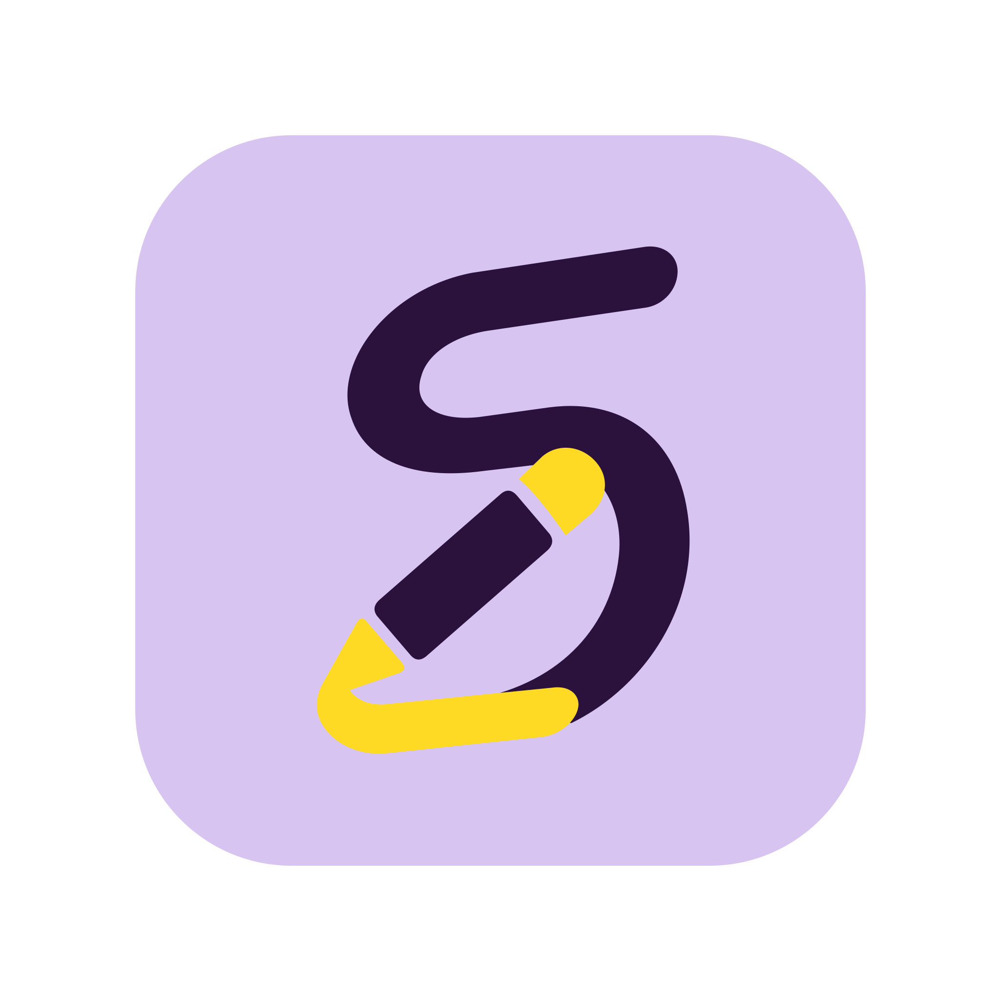

<!-- Copyright 2026 Evgeniy Udodov -->
<!-- SPDX-License-Identifier: GPL-3.0-only -->
<!-- Target-state editorial draft: planned capabilities are deliberately written in the present tense, as requested. This is not a verification of current release functionality. Relative links assume the repository root. Existing installation instructions, documentation links, and imagery require alignment with the target release before publication. -->

<p align="center">
  
</p>

<h1 align="center">Stillus</h1>

<p align="center">
  <strong>A native workspace for your notes, email, and the web.</strong><br>
  Write in Markdown. Read what matters. Let AI put your knowledge to work.
</p>

<p align="center">
  <a href="#get-stillus"><strong>Download &amp; get started</strong></a> ·
  <a href="#what-you-can-do">Explore features</a> ·
  <a href="docs/user-guide.md">User guide</a> ·
  <a href="#build-from-source">Build from source</a> ·
  <a href="CONTRIBUTING.md">Contribute</a>
</p>

<p align="center">
  <a href="https://github.com/stillus-ai/stillus/actions/workflows/ci.yml?query=branch%3Alatest+event%3Apush"></a>
  <a href="https://github.com/stillus-ai/stillus/releases/latest"></a>
  <a href="LICENSE"></a>
</p>

<p align="center"><sub>Early development · Review the platform notes below before installing.</sub></p>


<p align="center"><sub>Tagged notes and Markdown editing. Demo workspace, captured on Linux.</sub></p>

## From information to action

Stillus brings your notes, email, feeds, and watched pages into one desktop
workspace. Its AI assistant uses your personal knowledge to filter what you
read, help you write, and carry out tasks across the application at your request.

Ask it to prepare a reply using your project notes, reduce the noise in your
feeds, or unsubscribe you from newsletters. Your notes stay in local Markdown
files you control.

## What you can do

### Build your knowledge in Markdown

Write notes, develop ideas, and keep the context behind your work. Organize
with tags, favorites, and pins; find notes with local search. Your assistant
can draw on this knowledge when writing text or preparing a reply.

Notes use Markdown with YAML front matter. Open external `.md`, `.markdown`,
and `.txt` files and edit them in place. Autosave, crash recovery, and external
change detection help preserve your work.

### Read and reply to email

Read, compose, and send email inside Stillus. Ask the assistant to draft replies
using the context in your notes, or unsubscribe you from newsletters at your
request. Control notification sounds for each connected mailbox.

### Follow what matters

Read RSS and Atom feeds, or create a feed from a website that does not publish
one. Use local regular-expression filters to hide unwanted articles and keep
whitelist exceptions visible. Choose which feeds announce new items with a
notification sound.

With **Watch Pages**, add a URL, view the page in Stillus, and see what changed
between versions. Keep up with the pages you care about through their diffs.

### Give your assistant work to do

Ask for a result in everyday language. The assistant can use your notes as
context, write text, work with email and feeds, and perform actions across
Stillus through its application interface. Ask it to gather information and
populate a text file or spreadsheet.

| Ask Stillus | Put it to work |
| --- | --- |
| “Draft a reply using the decisions in my project notes.” | Prepare an email with the context from your knowledge base. |
| “Filter my feeds for updates relevant to this project.” | Focus your reading using the context you provide. |
| “Unsubscribe me from all newsletters in this mailbox.” | Delegate mailbox cleanup at your request. |
| “Gather this information and fill in this spreadsheet.” | Populate a spreadsheet with the information you need. |

Follow an agent's work through a detailed record of its steps, actions,
and results.

Stillus exposes application actions through a shared **Rust application API**,
giving the built-in assistant direct access to permitted operations across the
workspace without a local network server. Create **AI Chat** from the plus menu;
chats share categories, Favorites, dragging and Trash with notes and RSS. OpenAI
streams replies and can execute application tools; Anthropic currently supports
model catalogs. Provider adapters can be added independently of the chat engine.
API keys stay in the system credential store. Chats are saved locally with the
workspace, and each request is linked to the global AI journal. See the
[chat guide](docs/user-guide.md#ai-chats) and [storage details](docs/storage.md).

<details>
<summary><strong>More tools for the work around your writing</strong></summary>

**Monitor with readable checks.** Track DNS, SSL certificates, ping, HTTP,
TCP ports, and disk usage. Express what you expect as text:

```text
expect https://example.com 200 < 800ms
expect disk / < 80%
expect port db:5432 open
```

**Work with objects as text.** View and edit structured objects, such as a
process list, through a text interface.

**Sign PDFs.** Sign PDF documents inside Stillus.

**Check email exposure.** Check connected email addresses for appearances in
known data breaches.

</details>

## Get Stillus

Choose an archive for your operating system and architecture from
[GitHub Releases](https://github.com/stillus-ai/stillus/releases).
If there is no matching archive, see [Build from source](#build-from-source).

| Platform target | Before you install |
| --- | --- |
| **macOS · Apple Silicon** | Uses an ad-hoc signature; not Developer ID signed or notarized. A downloaded app requires explicit macOS approval. |
| **Linux · matching architecture** | Dynamically linked executable. Requires a compatible Linux desktop and system libraries; see the Linux notes below. |
| **Windows · x64, Windows 10/11** | Unsigned portable application targeting local NTFS. A successful cross-build does not establish native Windows validation; see the [Windows guide](docs/windows.md). |

<details>
<summary><strong>macOS: first launch</strong></summary>

Extract the release archive. Use an archive from the project's releases and
verify it against the accompanying `SHA256SUMS` before approving it.

Try opening `Stillus.app` once. If macOS blocks the launch, open
**System Settings → Privacy & Security → Security**, choose **Open Anyway**,
and confirm. This override is available for about an hour after the failed
launch attempt.

</details>

<details>
<summary><strong>Linux: first launch and requirements</strong></summary>

Use an archive built for the destination machine's architecture. Run the
`stillus` executable from the extracted package.

The application requires X11 or Wayland, the corresponding system libraries,
fonts, GTK4 4.0 or newer, and an XDG desktop portal for file dialogs.

See the [development guide](docs/development.md) for build and release
limitations.

</details>

<details>
<summary><strong>Windows: first launch</strong></summary>

Keep the extracted package files together and run `Stillus.exe`.
Required non-system runtime DLLs are included beside the executable.

See the [Windows guide](docs/windows.md) for filesystem boundaries and the
native validation checklist. The package also includes optional **Open With**
registration; it does not change default applications.

</details>

### Your first workspace

1. Launch Stillus and choose an existing workspace or create one. A workspace
   is the folder where Stillus keeps your notes.
2. Bring in what you work with: write a note, connect a mailbox, add a feed,
   or watch a page.
3. Configure an AI provider and ask the assistant to help with a task, such as
   drafting a reply using your notes.

Prefer to edit an existing file? Open it with Stillus from your file manager.
If no workspace is configured yet, Stillus asks you to choose one first.
The file stays in its original location. See the
[user guide](docs/user-guide.md) for details.

## Your files, your tools

Your workspace's `notes/` directory is the source of truth for notes.
Opening a workspace does not migrate or rewrite existing notes; unknown
metadata and unrelated files are preserved. Unencrypted notes are ordinary
Markdown with YAML front matter, so you can open them in another editor,
track them with Git, or back them up with your own tools.

You can encrypt individual note bodies using a workspace password and
authenticated age encryption. **Filenames and YAML metadata—including titles
and tags—remain readable.**

Recovery files can contain unsaved work. Read the
[storage and security guide](docs/storage.md) before changing your backup
setup or removing local state.

## Project status

Stillus is in early development. Check the
[release notes](https://github.com/stillus-ai/stillus/releases) and
[development guide](docs/development.md) for current limitations and known
dependency warnings.

Updates require your decision. Stillus checks for releases at startup and
offers them 24 hours after publication; manual installation through
**Settings → Updates** is available without that delay.
See [how updates work](docs/updates.md).

Built with Rust and Floem. Includes 17 interface language variants, with
English as the default.

## Build from source

Clone the repository before running any platform's build command:

```sh
git clone https://github.com/stillus-ai/stillus.git
cd stillus
```

All builds below require Docker Compose and a running Docker engine.
The macOS and Linux builds use pinned Rust 1.88.0 without a preinstalled
Rust toolchain. macOS builds additionally require an Apple Silicon Mac,
Xcode Command Line Tools, and `python3`.

| Target | Command | Output |
| --- | --- | --- |
| macOS · Apple Silicon | `make build-macos` | `dist/Stillus.app` and `dist/Stillus.dmg` |
| Linux · Docker container architecture | `make build-linux` | `dist/linux/<architecture>/stillus` |
| Windows · x64 | `make build-windows` | `dist/windows/x86_64/Stillus.exe` |

On macOS, open `dist/Stillus.dmg` and drag `Stillus.app` onto **Applications**
to install it. Then eject the disk image and launch Stillus from Applications.

For Linux, build on the destination architecture: `aarch64` or `x86_64`.
Windows cross-builds run on macOS or Linux; run `make test-windows-build`
and complete the [native Windows checklist](docs/windows.md) before
considering a build validated.

<details>
<summary><strong>Launch a macOS build with demo notes</strong></summary>

```sh
make demo-data
open dist/Stillus.app --args "$PWD/examples/demo-workspace"
```

`make demo-data` resets the generated demo notes. Keep your own writing
in a separate workspace.

To launch without the demo, run `open dist/Stillus.app`.

</details>

See the [development guide](docs/development.md) for toolchain details,
checks, benchmarks, and packaging, and the [CI guide](docs/ci.md) for
automated checks.

## Documentation

| Guide | Use it for |
| --- | --- |
| [User guide](docs/user-guide.md) | Workspaces, writing, external files, and feeds |
| [Storage and security](docs/storage.md) | File layout, encryption, recovery, and backups |
| [Development](docs/development.md) | Building, testing, benchmarks, and packaging |
| [Interface guidelines](docs/interface-guidelines.md) | Shared controls, action buttons, forms, and layout |
| [Windows](docs/windows.md) | Windows setup, filesystem boundaries, and validation |
| [Updates](docs/updates.md) | Release checks and installation |
| [Publishing](docs/publishing.md) | Versioning and GitHub Releases |

## Help shape Stillus

[Report a bug or suggest an improvement](https://github.com/stillus-ai/stillus/issues).
Include your operating system, Stillus version, and steps to reproduce a bug.
For code contributions, start with [Contributing](CONTRIBUTING.md).

To report a vulnerability privately, follow the
[security policy](SECURITY.md).

## License

Copyright 2026 Evgeniy Udodov. Stillus's own code, scripts, documentation,
and artwork are licensed under [GPL-3.0-only](LICENSE), without warranty.
Third-party dependencies retain their respective licenses.
